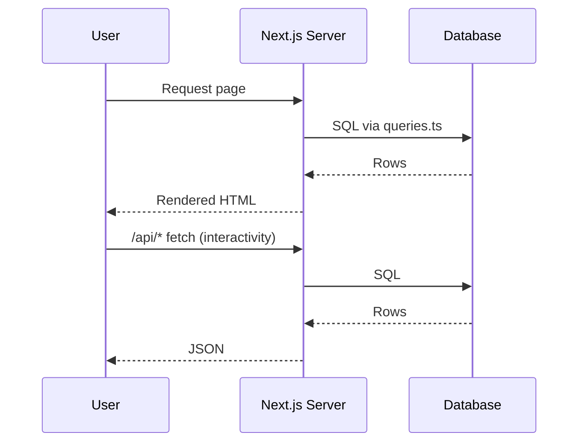

# Application Flow Diagram

```mermaid
sequenceDiagram
  participant U as User
  participant N as Next.js Server
  participant D as Database
  U->>N: Request page
  N->>D: SQL via queries.ts
  D-->>N: Rows
  N-->>U: Rendered HTML
  U->>N: /api/* fetch (interactivity)
  N->>D: SQL
  D-->>N: Rows
  N-->>U: JSON
```
