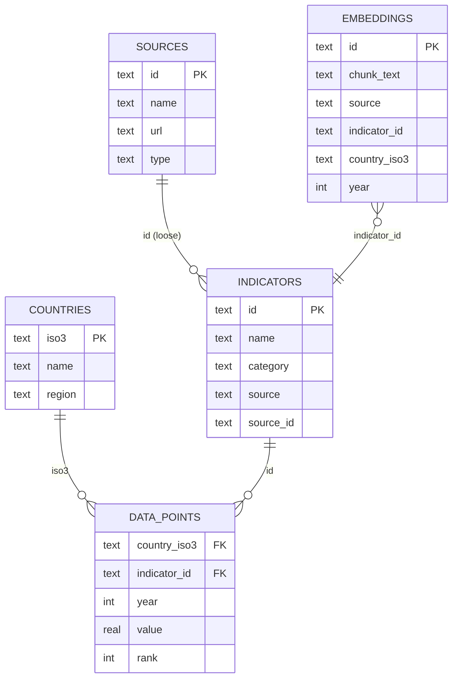

# Database ER Diagram

```mermaid
erDiagram
  COUNTRIES ||--o{ DATA_POINTS : "iso3"
  INDICATORS ||--o{ DATA_POINTS : "id"
  SOURCES ||--o{ INDICATORS : "id (loose)"
  EMBEDDINGS }o--|| INDICATORS : "indicator_id"
  COUNTRIES {
    text iso3 PK
    text name
    text region
  }
  INDICATORS {
    text id PK
    text name
    text category
    text source
    text source_id
  }
  DATA_POINTS {
    text country_iso3 FK
    text indicator_id FK
    int year
    real value
    int rank
  }
  SOURCES {
    text id PK
    text name
    text url
    text type
  }
  EMBEDDINGS {
    text id PK
    text chunk_text
    text source
    text indicator_id
    text country_iso3
    int year
  }
```
