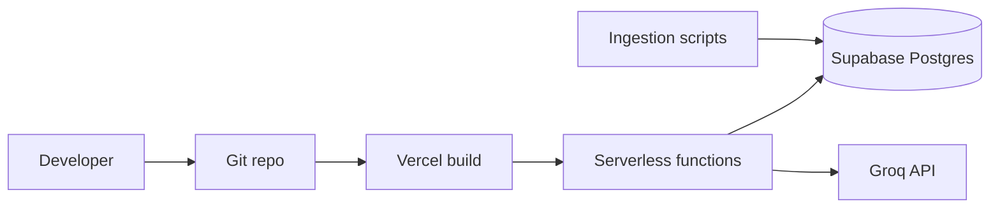

# Deployment Architecture

```mermaid
flowchart LR
  Dev[Developer] --> Git[Git repo]
  Git --> Vercel[Vercel build]
  Vercel --> Serverless[Serverless functions]
  Serverless --> PG[(Supabase Postgres)]
  Serverless --> Groq[Groq API]
  Ingest[Ingestion scripts] --> PG
```
Note: Local dev uses SQLite instead of PG.
